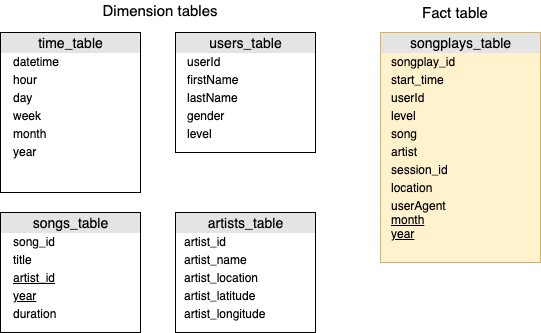

### Project 4

# Data Lake with AWS

> July 24, 2019
> Author: Natalia Meleshkina

## Summary of the project

Sparkify (music streaming startup, that we worked earlier) has grown their user base and song database and want to move their data warehouse to a data lake. Their data resides in S3, in a directory of JSON logs on user activity on the app, as well as a directory with JSON metadata on the songs in their app.

To accomplish this task we are going to implement data lake architecture on AWS cluster and build ETL pipeline, which:

- first we extracts data from S3
- process data with Spark
- and loads back to S3 as a set of dimensional tables.

## Data

Sparkify shared two datasets on Amazon S3.

1. Song dataset consists of JSON files and contains metadata about a song and the artist of that song. The files are partitioned by the first three letters of each song's track ID.

- Song data: `s3://udacity-dend/song_data`

2. Log dataset. Contains app activity logs from streaming app. The log files in the dataset are partitioned by year and month.

- Log data: `s3://udacity-dend/log_data`

Log data JSON path: `s3://udacity-dend/log_json_path.json`

To locate each song play, we filter records by `page = NextSong` in our queries.

## ETL process

To retreive data from S3 we use PySpark at AWS. We read data in JSON format, collect necessary data and save to parquet files.
For the parquet files we used star schema approach with Fact and Dimension tables.

## Project structure

Under our project folder we have following files:

- **data_wrangling.ipynb**  contains pySpark manipulation on json files
- **etl.py** - script which reads data from S3 and saves to parquet files for  analytics bak to S3.
- **dwh.cfg** - contains configuration information to set up and connect to Redshift cluster

### Environment and running ETL

This project can be run locally with  installed Anaconda and PySpark.

You can find recent package and installation guides here:

- <a href="https://www.anaconda.com/distribution/">Anaconda for Python</a>
- <a href="https://spark.apache.org/downloads.html">Apache Spark</a>

Also we use **Pandas** library in notebook to print out data in table

Project can be run on AWS and EMR cluster with PySpark preinstalled. We used notebook on EMR in order to explore and validate data to write accurate script (etl.py)
In order to avoid billing for using cluster resources Terminate cluster from AWS console.
